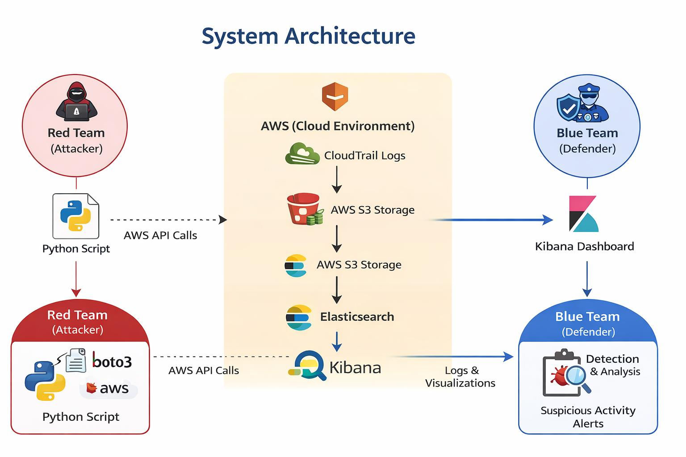
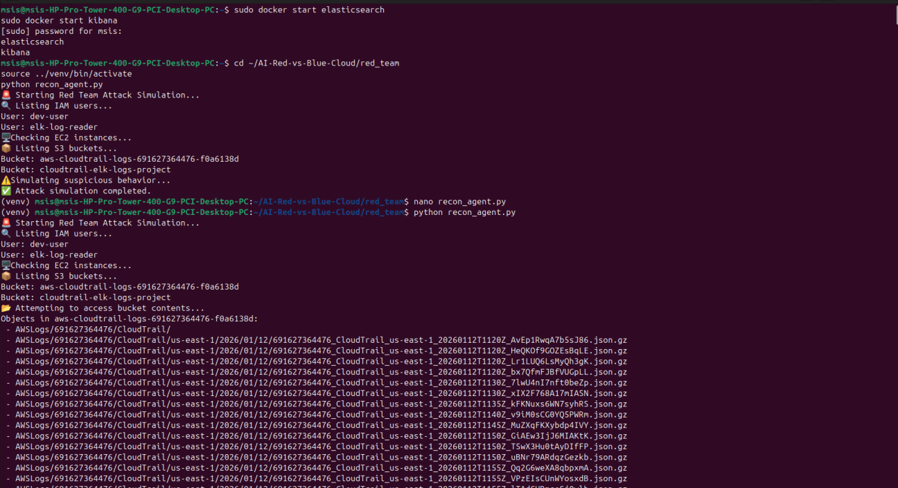
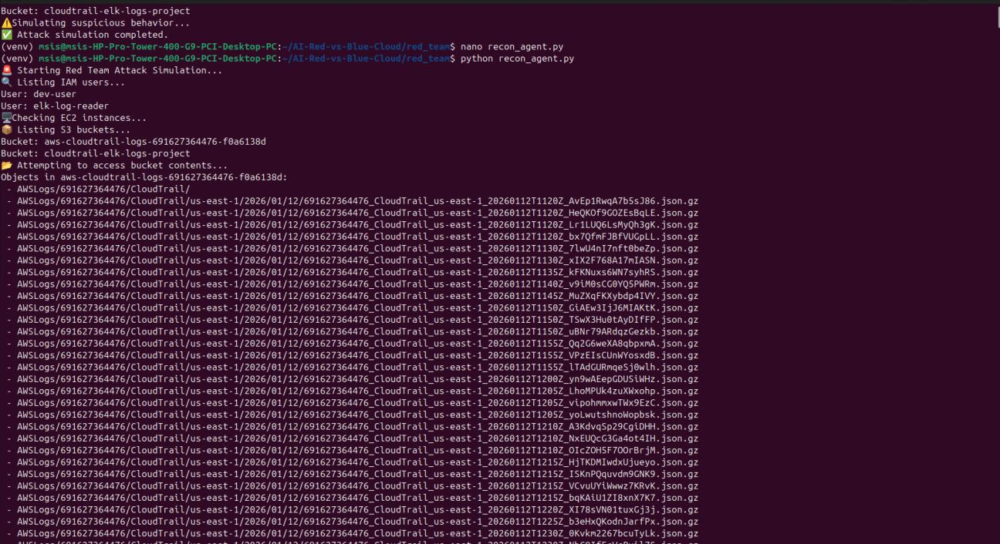
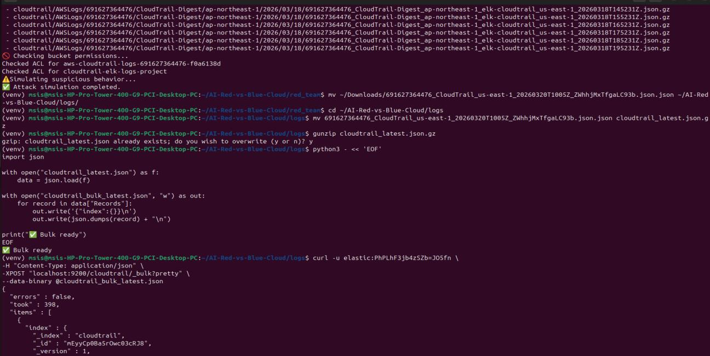
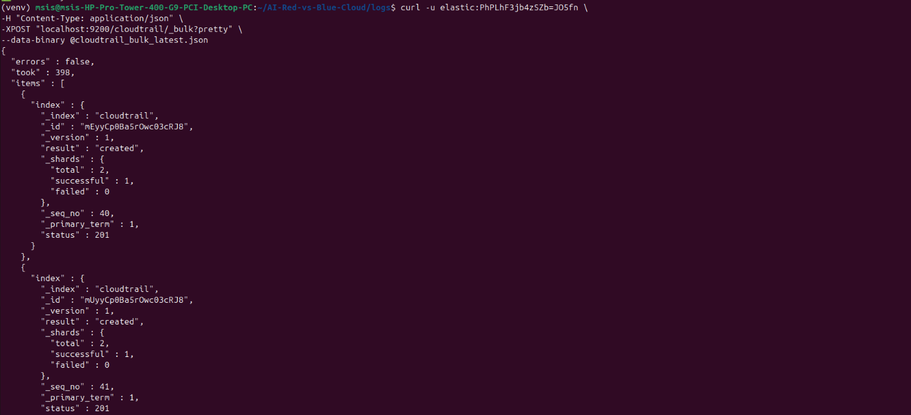
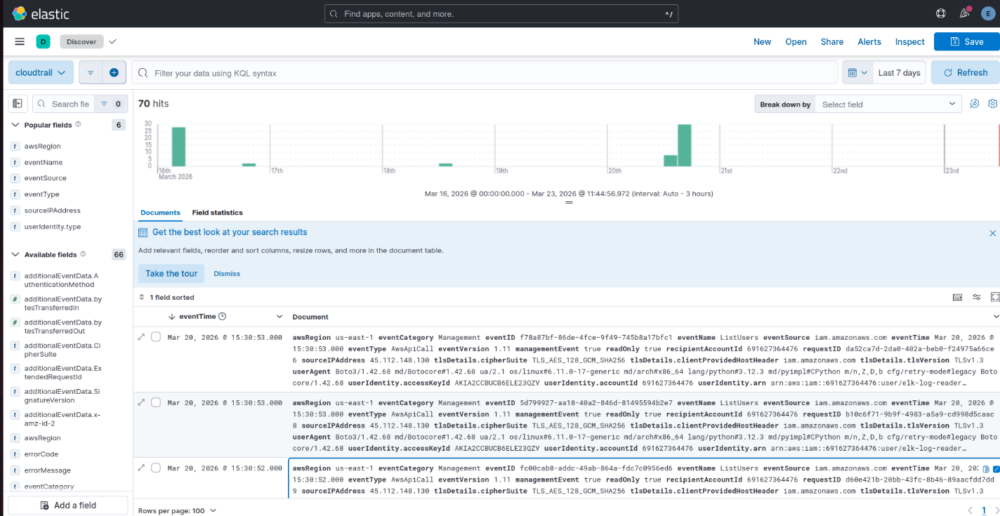

# Autonomous Cloud Defense: Red Team vs Blue Team


*(Formerly: Automated Red Team vs Blue Team for Cloud Misconfiguration Detection)*

Cloud security incidents are often caused by user misconfigurations rather than flaws in the cloud platform itself. This project demonstrates how an attacker can discover and exploit common AWS misconfigurations while defenders monitor the resulting activity through centralized logging and visualization.

> **⚠️ Lab / educational use only.** Every technique in this repository must only be run against resources you own inside an isolated AWS sandbox account. Nothing here should ever be pointed at production systems or infrastructure you don't control.

---

## Overview

- **Red Team** — intentionally misconfigures lab AWS resources (S3, EC2, IAM) and runs a Python-based reconnaissance/exploitation script (`recon_agent.py`) against them.
- **Blue Team** — captures every resulting API call via AWS CloudTrail, processes and ingests the logs into Elasticsearch, and visualizes attacker behavior in Kibana.

The goal is to show, in a safe and controlled environment, how insecure configurations get exploited — and how centralized logging and monitoring catch it.

## Architecture

```
 Red Team (Attacker)                AWS (Cloud Environment)              Blue Team (Defender)
 ┌───────────────────┐        ┌───────────────────────────┐        ┌───────────────────────┐
 │  recon_agent.py    │  API   │  CloudTrail Logs          │  logs  │  Elasticsearch         │
 │  (boto3 + AWS CLI) │ ─────► │  S3 / EC2 / IAM Resources │ ─────► │  Kibana Dashboards     │
 └───────────────────┘  calls  └───────────────────────────┘        └───────────────────────┘
                                                                       │
                                                                       ▼
                                                          Detection & Analysis /
                                                          Suspicious Activity Alerts
```

## Features

- Controlled simulation of common cloud misconfigurations (public storage, open security groups, over-permissioned IAM)
- Ethical, sandboxed Red Team attack scripting using `boto3`
- Automated log capture via AWS CloudTrail and CloudWatch
- Log transformation pipeline: raw CloudTrail JSON → Elasticsearch Bulk API format
- Kibana dashboards for event timelines, API activity, and source-IP/user-identity analysis
- End-to-end demonstration of detection and remediation

## Tech Stack

| Layer | Tool |
|---|---|
| Cloud Platform | AWS (S3, EC2, IAM, CloudTrail, CloudWatch) |
| Attack Simulation | Python, boto3, AWS CLI v2 |
| Log Storage & Search | Elasticsearch 8.x |
| Visualization | Kibana 8.x |
| Host OS | Ubuntu Linux 22.04 LTS |
| Containers | Docker |

## Skills Demonstrated

- AWS Security
- Cloud Security
- SOC Operations
- Threat Detection & Threat Hunting
- Elasticsearch
- Kibana
- Python Automation (boto3)
- Incident Investigation & Remediation

## Prerequisites

- An isolated AWS sandbox account (do not use a production/shared account)
- Ubuntu 22.04 LTS (or similar) host with Docker installed
- Python 3.10+ and `pip`
- AWS CLI v2, configured with credentials for a dedicated lab IAM user

See **[Installation Guide](./RedBlue_Installation_Guide.pdf)** for full, step-by-step setup instructions.

## Quick Start

```bash
# 1. Clone the repository
git clone https://github.com/<your-username>/red-vs-blue-cloud.git
cd red-vs-blue-cloud

# 2. Set up Python environment
python3 -m venv venv
source venv/bin/activate
pip install -r requirements.txt

# 3. Configure AWS credentials
aws configure

# 4. Start the ELK stack
docker start elasticsearch
docker start kibana

# 5. Run a Red Team simulation
cd red_team
python recon_agent.py

# 6. Pull, convert, and ingest the resulting CloudTrail logs
cd ../logs
aws s3 sync s3://aws-cloudtrail-logs-<your-account-id>/AWSLogs ./AWSLogs
python convert_to_bulk.py
curl -u elastic:<password> -H "Content-Type: application/json" \
  -XPOST "localhost:9200/cloudtrail/_bulk?pretty" --data-binary @cloudtrail_bulk_latest.json -k
```

Then open Kibana at `http://<HOST_IP>:5601`, select the `cloudtrail` data view, and explore the ingested activity in **Discover**.

Full walkthrough (installation, running simulations, reading dashboards, remediation, troubleshooting) is in the **[User Manual](./RedBlue_User_Manual.pdf)**.

## Demo Workflow

1. Deploy the AWS lab (S3, EC2, IAM)
2. Configure CloudTrail logging
3. Run the Red Team simulation (`recon_agent.py`)
4. Collect the resulting CloudTrail logs
5. Convert logs to Elasticsearch bulk format
6. Ingest logs into Elasticsearch
7. Investigate events in Kibana

## Project Structure

```
red-vs-blue-cloud/
│
├── red_team/
│   └── recon_agent.py         # Simulated reconnaissance & exploitation script
│
├── logs/
│   ├── convert_to_bulk.py     # Converts raw CloudTrail JSON to Elasticsearch bulk format
│   └── AWSLogs/                # Synced raw CloudTrail logs (.json.gz)
│
├── docker/                     # Elasticsearch / Kibana container configuration
│
├── docs/
│   ├── RedBlue_Installation_Guide.pdf
│   ├── RedBlue_User_Manual.pdf
│   └── RedBlue_Functional_Document.pdf
│
├── screenshots/
│
├── requirements.txt
└── README.md
```

## Screenshots

### System Architecture



### Red Team Attack Simulation



### CloudTrail Log Extraction & Preprocessing



### Log Ingestion into Elasticsearch



### ELK Stack Initialization



### Kibana Dashboard Visualization



## Sample Results

**Detected API calls** (via `recon_agent.py`, captured in CloudTrail and visualized in Kibana):

- `ListUsers`
- `ListRoles`
- `DescribeInstances`
- `ListBuckets`
- `GetObject`

**Log pipeline** — CloudTrail logs are extracted, converted, and bulk-ingested into Elasticsearch with `"errors": false` on every run.

**Kibana dashboard** — visualizes event timelines, API activity, source IPs, and user identities, confirming the Blue Team can monitor and detect suspicious behavior effectively.

## Security & Ethics

- All attack activity is confined to resources created specifically for this lab, inside an isolated AWS account.
- No techniques here should be used against systems you do not own or have explicit written authorization to test.
- Misconfigurations introduced for testing (public buckets, open security groups, over-permissioned roles) should be reverted once testing is complete.

## Future Work

- AI/ML-based anomaly detection instead of manual pattern review
- Real-time alerting and automated response (auto-restrict access, auto-revert IAM changes)
- Integration with enterprise SIEM platforms
- Multi-cloud support (Azure, GCP)

## Documentation

| Document | Purpose |
|---|---|
| [Installation Guide](./RedBlue_Installation_Guide.pdf) | One-time environment setup — AWS resources, ELK stack, credentials |
| [User Manual](./RedBlue_User_Manual.pdf) | Day-to-day operation — running simulations, reading dashboards, remediating findings |
| [Functional Requirements Document](./RedBlue_Functional_Document.pdf) | What the system is required to do, actors, workflows, traceability |

## Authors

- K. Sthuthi Nayak

Academic project developed at the Manipal School of Information Sciences, MAHE Manipal, under the guidance of Dr. Sreepathy H V, Assistant Professor, Manipal School of Information Sciences, MAHE Manipal.

## References

- [AWS Shared Responsibility Model](https://aws.amazon.com/compliance/shared-responsibility-model/)
- [AWS CloudTrail User Guide](https://docs.aws.amazon.com/awscloudtrail/latest/userguide/cloudtrail-user-guide.html)
- [Amazon CloudWatch User Guide](https://docs.aws.amazon.com/AmazonCloudWatch/latest/monitoring/WhatIsCloudWatch.html)
- [Elastic Stack Documentation](https://www.elastic.co/guide/index.html)
- [Cloud Security Alliance — Security Guidance v4.0](https://cloudsecurityalliance.org/artifacts/security-guidance-v4/)
- [MITRE ATT&CK Framework](https://attack.mitre.org/)
